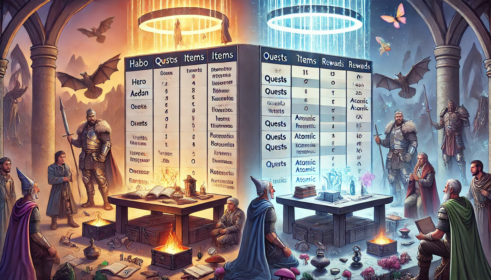

### **The Quest for 1NF Order**

**Once upon a time** in the mystical realm of  **DataLand** , there existed a table called  **HeroesAndQuests** . This table was home to brave heroes and their quests. But alas, there was a problem—chaos reigned within the table. Heroes, along with their data, were jumbled and messy, preventing DataLand from maintaining true order. **The wise sage, Master 1NF (First Normal Form),** saw this chaos and knew it was his duty to bring order and structure.

**The Chaos Unfolds:**
The HeroesAndQuests table contained the following row, depicting multiple items and rewards bunched together, and multiple quests assigned to the same hero:

| HeroID | HeroName | Rank      | HeroType | Strength | HeroBiography                | HeroExperience | QuestID | QuestName                  | Difficulty | QuestStartDate | QuestEndDate | QuestDuration | Items               | Rewards                           |
| ------ | -------- | --------- | -------- | -------- | ---------------------------- | -------------- | ------- | -------------------------- | ---------- | -------------- | ------------ | ------------- | ------------------- | --------------------------------- |
| 1      | Aedan    | Legendary | Warrior  | 85       | A fearless leader of armies. | 1200 XP        | 101     | Quest of the Shadowed Vale | Medium     | 2024-01-01     | 2024-01-10   | 9             | Sword, Shield       | Amulet of Light, Ring of Vitality |
| 1      | Aedan    | Legendary | Warrior  | 85       | A fearless leader of armies. | 1200 XP        | 102     | Trial of the Cursed Woods  | Hard       | 2024-02-01     | 2024-02-07   | 6             | Healing Potion (x5) | Ring of Vitality                  |

Master 1NF observed the following issues:

* **Repeated Hero Information** : Aedan, the Legendary Warrior, was mentioned multiple times for each quest, repeating data needlessly.
* **Multiple Values in Single Cells** : The **Items** and **Rewards** columns listed multiple values within a single cell, violating the sacred law of 1NF that each cell should contain atomic (indivisible) values.

**The Sage's Solution:**
Master 1NF decreed that  **every table must be restructured to have only one value per cell** , and  **each row must be unique** .

**The Transformation:**
To achieve 1NF, the table was split into two tables: one for heroes and one for quests.

1. **Heroes Table:**| HeroID | HeroName | Rank      | HeroType | Strength | HeroBiography                | HeroExperience |
   | ------ | -------- | --------- | -------- | -------- | ---------------------------- | -------------- |
   | 1      | Aedan    | Legendary | Warrior  | 85       | A fearless leader of armies. | 1200 XP        |

3. **Quests Table:**| QuestID | HeroID | QuestName                  | Difficulty | QuestStartDate | QuestEndDate | QuestDuration | Item                | Reward           |
   | ------- | ------ | -------------------------- | ---------- | -------------- | ------------ | ------------- | ------------------- | ---------------- |
   | 101     | 1      | Quest of the Shadowed Vale | Medium     | 2024-01-01     | 2024-01-10   | 9             | Sword               | Amulet of Light  |
   | 101     | 1      | Quest of the Shadowed Vale | Medium     | 2024-01-01     | 2024-01-10   | 9             | Shield              | Ring of Vitality |
   | 102     | 1      | Trial of the Cursed Woods  | Hard       | 2024-02-01     | 2024-02-07   | 6             | Healing Potion (x1) | Ring of Vitality |
   | 102     | 1      | Trial of the Cursed Woods  | Hard       | 2024-02-01     | 2024-02-07   | 6             | Healing Potion (x2) | NULL             |
   | 102     | 1      | Trial of the Cursed Woods  | Hard       | 2024-02-01     | 2024-02-07   | 6             | Healing Potion (x3) | NULL             |
   | 102     | 1      | Trial of the Cursed Woods  | Hard       | 2024-02-01     | 2024-02-07   | 6             | Healing Potion (x4) | NULL             |
   | 102     | 1      | Trial of the Cursed Woods  | Hard       | 2024-02-01     | 2024-02-07   | 6             | Healing Potion (x5) | NULL             |

**Order Restored:**
By splitting the data this way, every cell held only one value, and duplicate hero data was eliminated from the **Quests** table. The table was now in 1NF, and Master 1NF’s wisdom prevailed. **The realm of DataLand thrived once more,** its structure secure and logical.

---

### Takeaway:

* 1NF ensures that tables have **atomic** values—each cell contains a single value.
* **Redundant data** is minimized by organizing related data into separate tables.
* This story shows how structuring data properly leads to clarity and efficiency.
